# Visitor Management System

A full-featured, enterprise-grade visitor management system built with **Next.js 16**, **Prisma 7**, and **NextAuth**. Comparable in scope to Odoo's visitor management module — with a clean modern UI, real-time dashboard, QR self-check-in, badge printing, watchlist security, and analytics.

---

## Screenshots

### Login
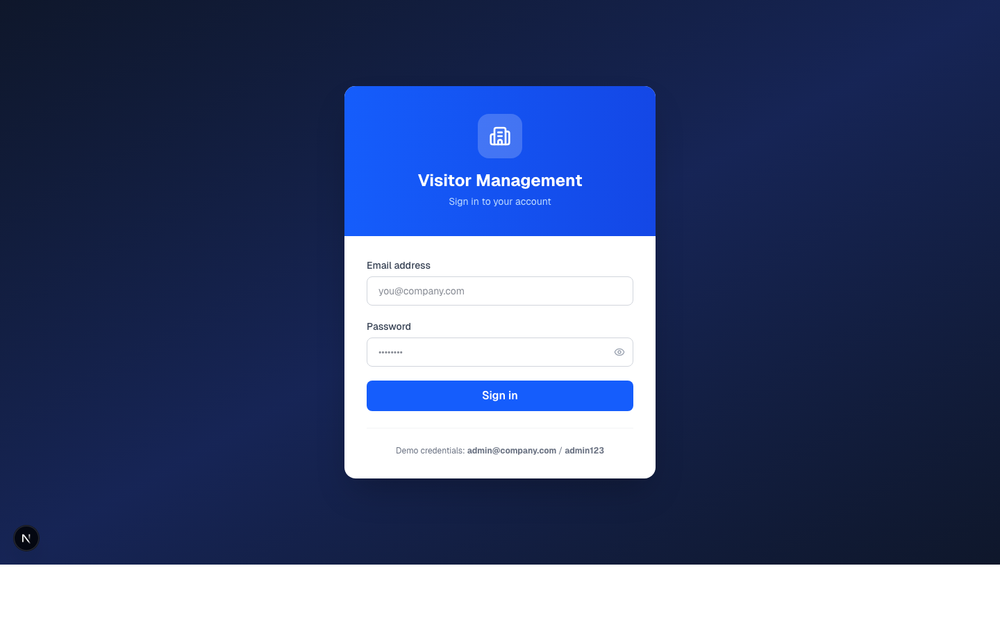

### Dashboard
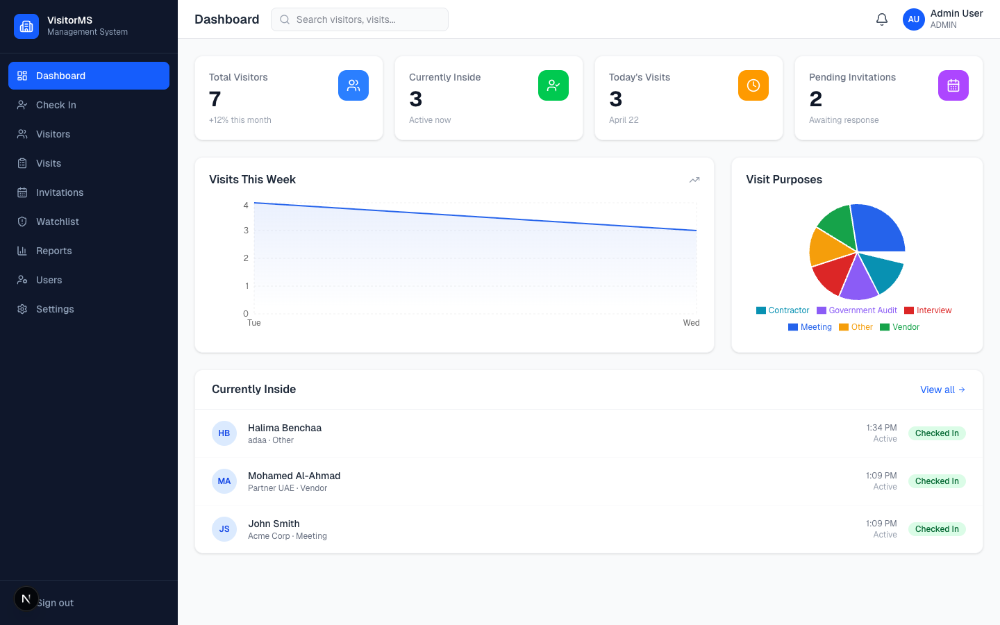

### Visitor Check-in (Staff)
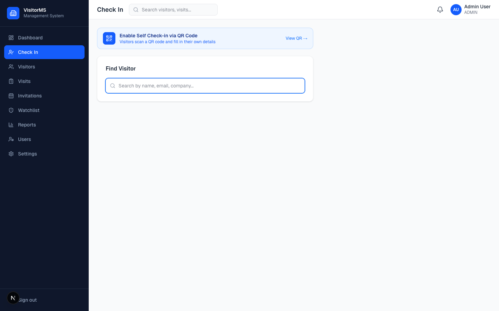

### Visitor Self Check-in via QR Code
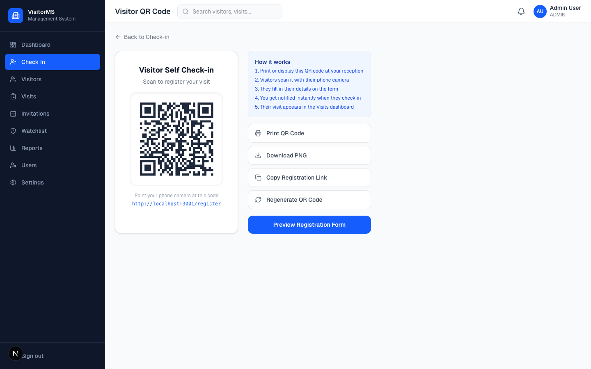

### Self-Registration Form (Visitor's Phone)
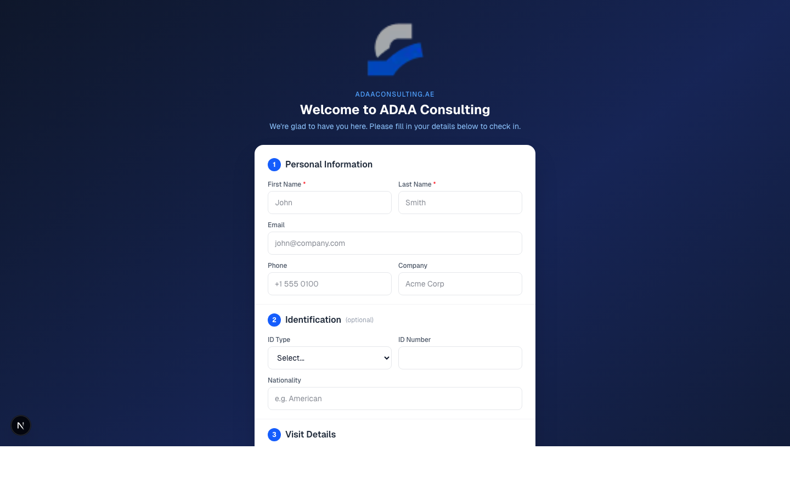

### Visitors Directory
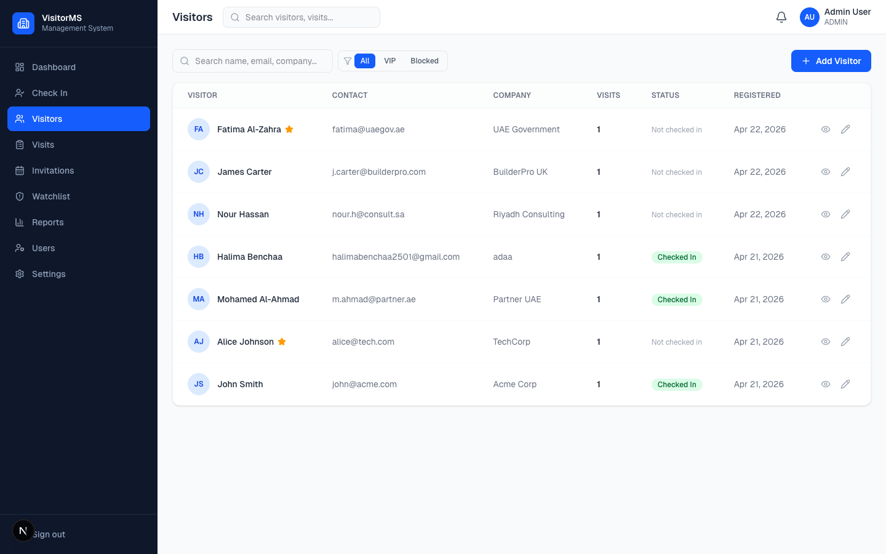

### Visits Log
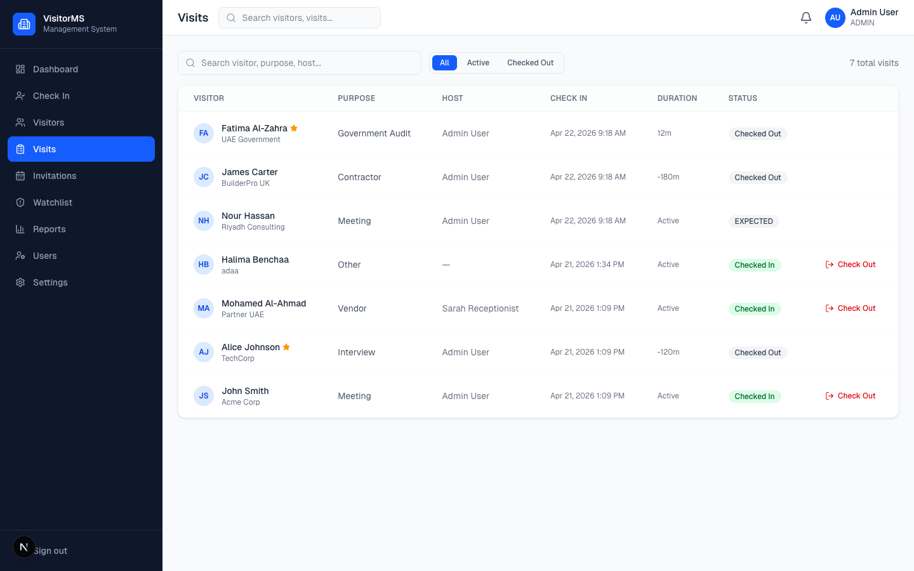

### Invitations
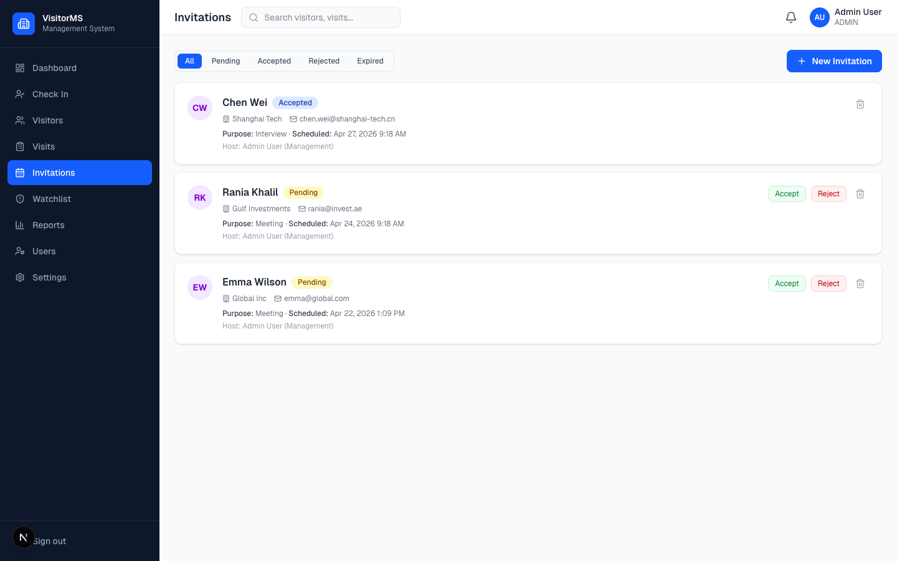

### Security Watchlist
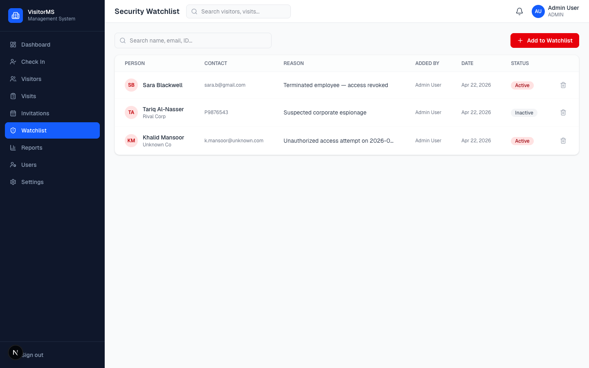

### Reports & Analytics
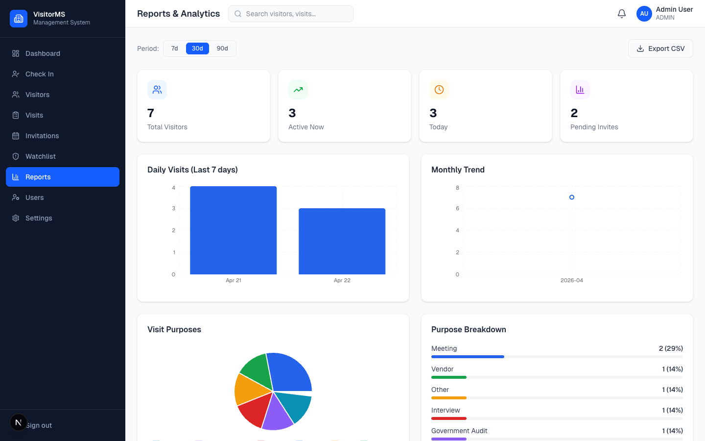

### Settings
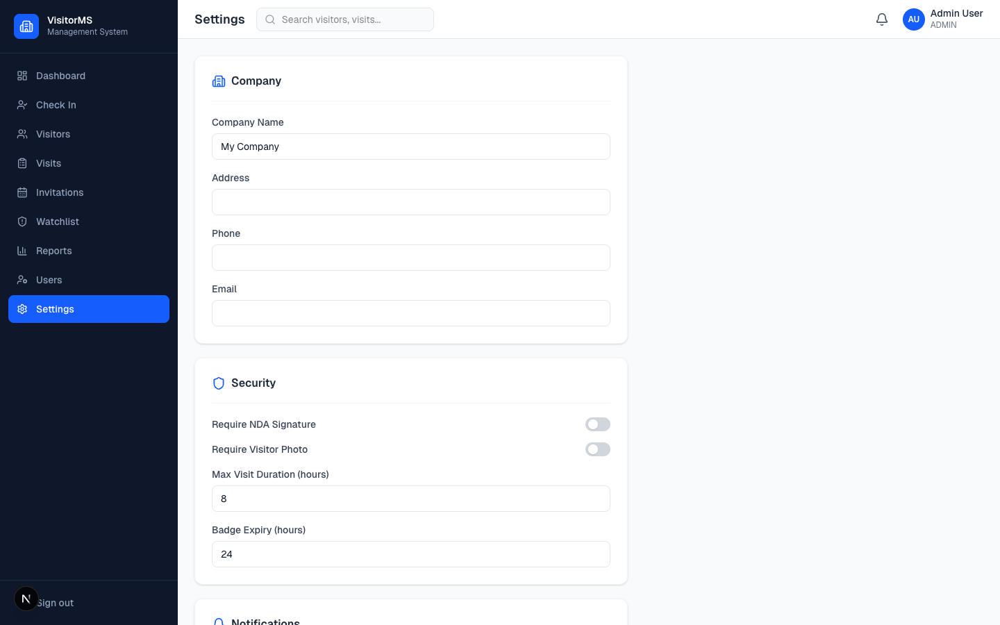

### User Management
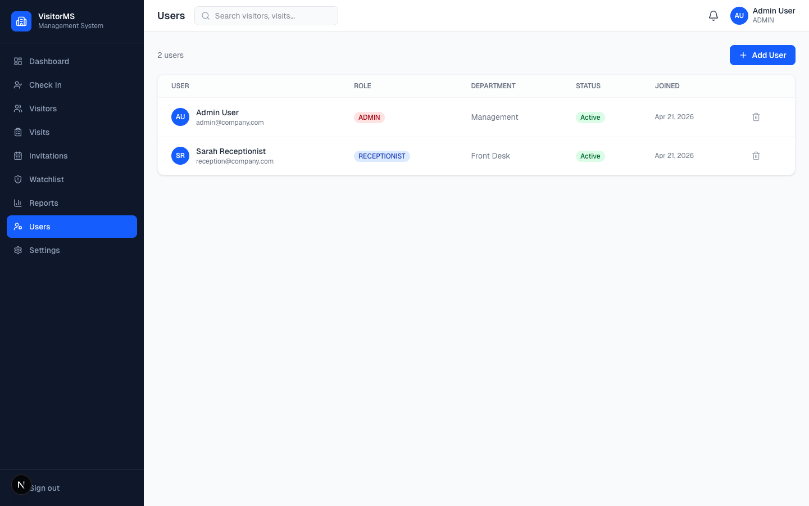

---

## Features

| Module | Capabilities |
|--------|-------------|
| **Dashboard** | Live KPI cards, weekly area chart, visit-purpose pie chart, currently-inside feed |
| **Check-in (Staff)** | Search visitor, watchlist alert, purpose/host/NDA/vehicle form, QR badge generation, print badge |
| **Self Check-in (QR)** | Visitor scans QR → fills form on their phone → auto check-in, host notified by email |
| **Visitors** | Full directory with search, VIP / blacklist filters, profile page with visit history |
| **Visits** | All visits with status filter, one-click check-out, duration tracking |
| **Invitations** | Pre-register visitors, send email invite with link, accept/reject flow |
| **Watchlist** | Security blacklist — auto-flags matching visitors on any check-in |
| **Reports** | Bar, line & pie charts, date-range filter, CSV export |
| **Users** | Manage staff with roles: ADMIN, RECEPTIONIST, SECURITY |
| **Settings** | Company info, NDA policy, badge expiry, notification toggles |
| **Notifications** | In-app bell + email to host on every check-in |

---

## Tech Stack

- **Framework** — Next.js 16 (App Router, Turbopack)
- **Database** — SQLite via Prisma 7 + `@prisma/adapter-better-sqlite3`
- **Auth** — NextAuth v4 (JWT sessions, credentials provider)
- **UI** — Tailwind CSS v4, Radix UI, Lucide icons
- **Charts** — Recharts
- **Email** — Nodemailer
- **QR Codes** — `qrcode` npm package
- **PDF / Print** — Browser print API with `@media print` badge layout

---

## Getting Started

### 1. Install dependencies

```bash
npm install
```

### 2. Configure environment

Edit `.env`:

```env
DATABASE_URL="file:./dev.db"
NEXTAUTH_URL="http://localhost:3000"
NEXTAUTH_SECRET="change-this-in-production"

# Optional — for email notifications
SMTP_HOST=""
SMTP_PORT="587"
SMTP_USER=""
SMTP_PASS=""
SMTP_FROM="noreply@company.com"

COMPANY_NAME="My Company"
```

### 3. Set up the database

```bash
npx prisma migrate dev
```

### 4. Seed demo data

Start the dev server, then POST to the seed endpoint:

```bash
npm run dev
curl -X POST http://localhost:3000/api/seed
```

This creates:
- **Admin** — `admin@company.com` / `admin123`
- **Receptionist** — `reception@company.com` / `reception123`
- Sample visitors, visits, and one pending invitation

### 5. Run

```bash
npm run dev
```

Open [http://localhost:3000](http://localhost:3000).

---

## QR Self Check-in

1. Log in as admin → go to **Check In** → click **"View QR →"**
2. Print or display the QR code at reception
3. Visitors scan with their phone camera — no app needed
4. They fill in their name, purpose, and who they're visiting
5. The visit is logged instantly and the host receives an email

---

## Roles

| Role | Access |
|------|--------|
| `ADMIN` | Full access — users, settings, delete records |
| `RECEPTIONIST` | Check-in, visitors, visits, invitations |
| `SECURITY` | Watchlist management, visits view |

---

## Project Structure

```
src/
├── app/
│   ├── (auth)/login/          # Login page
│   ├── (dashboard)/           # All protected pages
│   │   ├── dashboard/
│   │   ├── check-in/
│   │   │   └── qr/            # QR code display
│   │   ├── visitors/
│   │   ├── visits/
│   │   ├── invitations/
│   │   ├── watchlist/
│   │   ├── reports/
│   │   ├── users/
│   │   └── settings/
│   ├── api/                   # Route handlers
│   │   ├── auth/[...nextauth]/
│   │   ├── visitors/
│   │   ├── visits/
│   │   ├── invitations/
│   │   ├── watchlist/
│   │   ├── dashboard/
│   │   ├── notifications/
│   │   ├── users/
│   │   ├── settings/
│   │   ├── register/          # Public self-registration API
│   │   └── seed/
│   ├── register/              # Public visitor self-check-in form
│   └── invitation/[token]/    # Public invitation response page
├── components/
│   ├── layout/                # Sidebar, Header, SessionProvider
│   └── visitors/              # VisitorBadge
├── lib/
│   ├── prisma.ts
│   ├── auth.ts
│   ├── utils.ts
│   ├── email.ts
│   └── qrcode.ts
├── proxy.ts                   # Auth route protection (Next.js 16)
└── types/
    └── next-auth.d.ts
prisma/
├── schema.prisma
└── migrations/
```

---

## License

MIT
